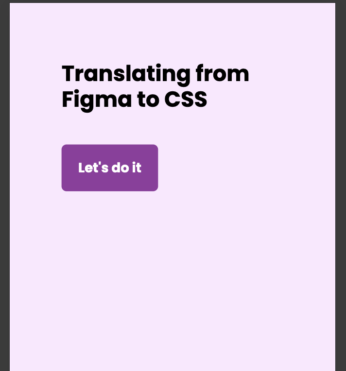

# Translating simple Figma design

### Key learnings:

- Utilising `rem` & `em`
- Useful tip if you wish to have precise pixel match, press `r` key to display a square for measuring distance between elements

# Design

