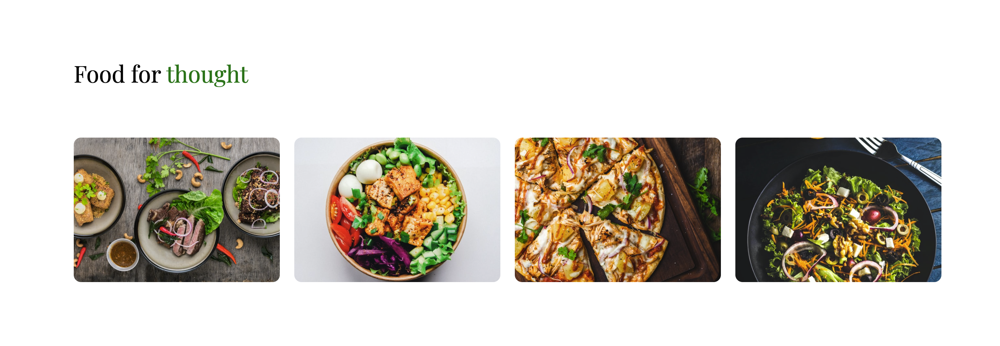

# Translating food gallery UI

### Key learnings:

- explored basics of `flexbox`
- default for `display: flex` is row to change the direction to column:
  - `flex-direction: column`, this would also swap the likes of `justify-content` & `align-items`
- used the `order` property of `flex` to re-arrange 1 of the images.
- `flexbox` is 1 dimensional per container - either `column` or `row`.
- `object-fit: cover` - resizes the image to fit the container while maintaining its aspect ratio. Cropping the image if necessary - maintaining its quality.

The below `css` snippet shows how to add flex to a container that would wrap over when there is no space left`. Whilst keeping it horizontally centered as well as vertically.

```css
.container {
  display: flex;
  flex-wrap: wrap;
  justify-content: center;
  align-items: center;
}
```

# Design


